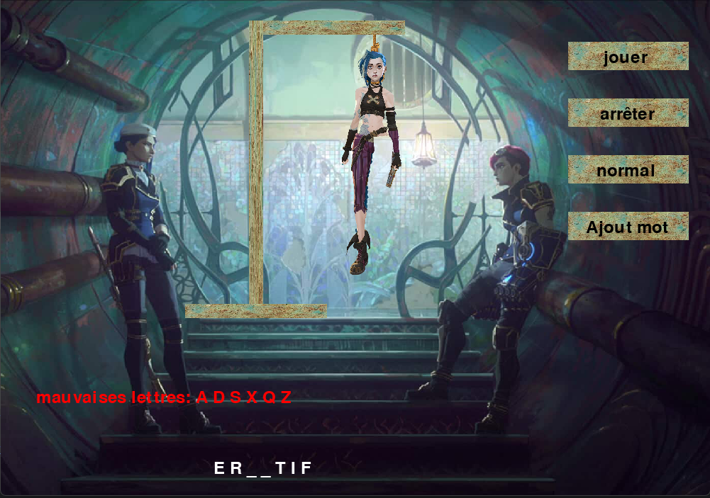

# **Pendu**

## **Introduction**

Le projet Pendu vous permet de jouer au célèbre jeu du pendu en utilisant 
notre banque personnelle de mots. Attention, la plupart de nos mots sont très
difficiles à deviner ! Vous pouvez aussi ajouter vos propres mots au jeu pour
personnaliser votre partie et choisir parmi trois niveaux de difficulté
pour rendre le jeu encore plus dur. À vous de jouer !

Ce jeu a été créé en utilisant la librairie PyGame de Python.

- Langage utilisé : Python
- Librairies utilisées : PyGame, random

## **Installation**

Pour installer le Pendu, merci de suivre les étapes suivantes :

1. Cloner le repository suivant : **`git clone https://github.com/thibault-caron/pendu`**
2. Télécharger le langage Python : **https://www.python.org/downloads/**
3. Installez la librairie PyGame : **`pip install pygame`**
4. Naviguez jusqu'au dossier du Pendu: **`cd pendu`**

## **Usage**

Pour utiliser le Pendu, merci de suivre les étapes suivantes :

1. Ouvrez le terminal de votre ordinateur.
2. Naviguez jusqu'au dossier du Pendu : **`cd pendu`**
3. Lancez le fichier main.py : **`py main.py`** ou **`python main.py`** ou **`python3 main.py`**
4. Jouez au jeu.

## **Auteurs et Remerciements**

Le projet Pendu a été créé par :

- **[Thibault CARON](https://github.com/thibault-caron)**
- **[Lorenzo OTTAVIANI](https://github.com/lorenzo-ottaviani)**
- **[Olivier PORTAL](https://github.com/olivier-portal)**

Merci à tous les contributeurs pour leur travail et leur investissement sur ce projet.
